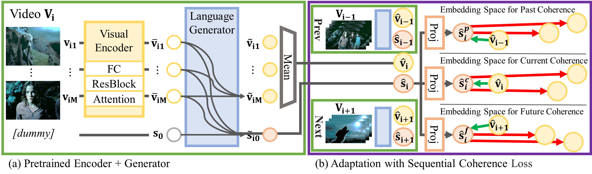

# Transitional Adaptation of Pretrained Models for Visual Storytelling (TAPM)

- Authors:
  [Youngjae Yu1∗](https://yj-yu.github.io/home/),
  [Jiwan Chung*](https://vision.snu.ac.kr/people/jiwanchung.html),
  [Heeseung Yun](https://vision.snu.ac.kr/people/heeseungyun.html),
  [Jongseok Kim](https://ozmig77.github.io/),
  [Gunhee Kim](https://vision.snu.ac.kr/gunhee/)
- Paper: [CVPR2021](https://openaccess.thecvf.com/content/CVPR2021/html/Yu_Transitional_Adaptation_of_Pretrained_Models_for_Visual_Storytelling_CVPR_2021_paper.html)
  ([pdf](https://openaccess.thecvf.com/content/CVPR2021/papers/Yu_Transitional_Adaptation_of_Pretrained_Models_for_Visual_Storytelling_CVPR_2021_paper.pdf),
  [slide](assets/cvpr_tapm_slides.pdf),
  [video](https://www.youtube.com/watch?v=-a7V4TYA1T4))

## Introduction

PyTorch code for the CVPR 2021 paper "Transitional Adaptation of Pretrained Models for Visual Storytelling".

We propose an explicit visual adaptation step to harmonize the visual encoder with the pretrained language models.
Our simple adaptation objective aims to bridge the gap between the nature of the information stored in the visual encoder and the language decoder.



## Requirements

Python 3.7
PyTorch 1.5

The other dependencies are specified in the `requirements.txt` file.

## installation

```
git clone $THIS_REPO
cd $THIS_REPO
pip install requirements_primary.txt
pip install requirements.txt
```

download `stanfordnlp.download('en_ewt')`

## Data Preparation

Store the datasets in `$THIS_REPO/data`
e\.g\. `data/LSMDC` and `data/VIST`

For detailed instructions on how to extract relevant features, please refer to our guide on
[Dataset Preperation](guides/feature_extraction.md)

## LSMDC 2019
Please follow the instructions on [Download](https://sites.google.com/site/describingmovies/download?authuser=0) to download the dataset.

### Text
From the downloaded files, extract and move the `task1` folder to under `$THIS_REPO/data/LSMDC` directory.

### Features
The above link contains the two features: I3D and Resnet152.
Extract and move both features to under `$THIS_REPO/data/LSMDC/features` directory.

### ResNext Features
We also provide alternative features extracted with ResNext.
Note that to reproduce our results you need these features instead of the official ones.
[Download](https://drive.google.com/uc?id=1dqfpX76QxVnOOThgY8-cuSG5m-0LVZZk)

## VIST
Please follow the instructions on [Download](http://visionandlanguage.net/VIST/dataset.html) to download the dataset.

### Text
Download the Stories of Images-in-Sequence (SIS) set, extract and move the folder to under `$THIS_REPO/data/VIST` directory.
e\.g\. `data/VIST/sis`

### Features
The above link contains the raw image files.

#### Images

Use [Resnet152 pretrained on ImageNet](https://pytorch.org/docs/stable/torchvision/models.html) to extract features for each image.
Store the features with `numpy.save` following the below structure.
```json
resnet/
  train/
    {image_id}.npy
  test/
  val/
```

#### Box
Use Faster-RCNN model to extract object classification logits.
Store the features with `numpy.save` following the below structure.
```json
rcnn/
  train/
    {image_id}.npy
  test/
  val/
```

#### vilbert
Use VILBERT model to extract last hidden state vector.
Store the features with `pickle.dump` following the below structure.
```json
rcnn/
  train/
    {album_id}/
      {image_id}.pickle
  test/
  val/
```

## Train

### LSMDC 2019

```bash
cd code
python cli.py train with model=no_gt_sos fix_gpt_epoch=5 feature_names="['video', 'images']"
```

### VIST

```bash
python cli.py train with model=no_gt_sos fix_gpt_epoch=3 feature_names="['images', 'box']" use_vist=True
```

with additional vilbert features

```bash
cd code
python cli.py train with model=no_gt_sos fix_gpt_epoch=3 feature_names="['images', 'box', 'vilbert']" use_vist=True
```

## Run Scripts

```bash
python cli.py scripts with cript=[SCRIPT_NAME] (additional args)
```

Please take a look at the `config.py` file for more options.
